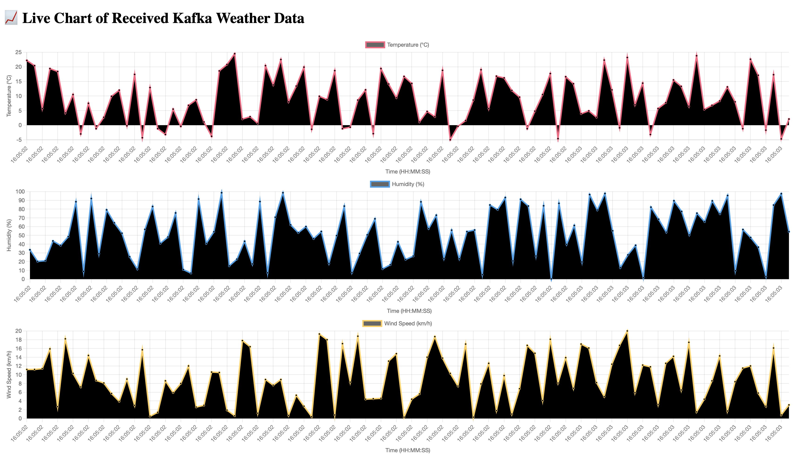
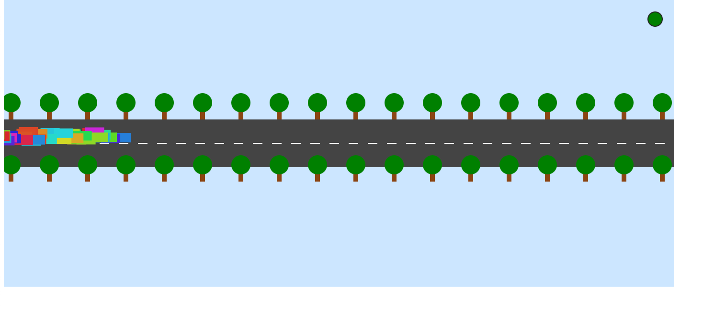
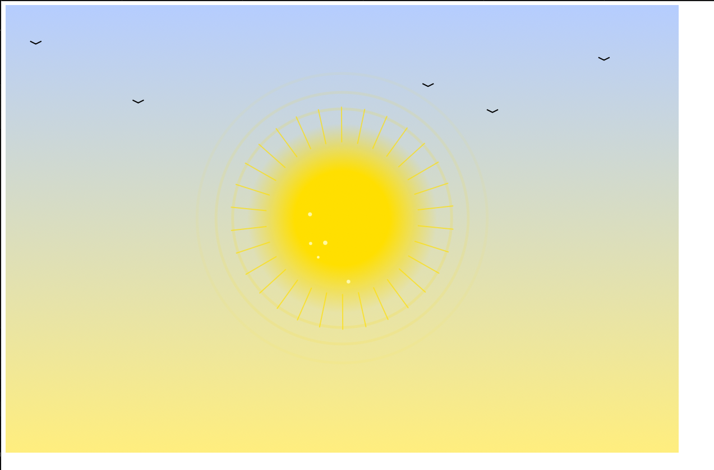

# Kafka PoC Showcase

This repository presents a proof-of-concept (PoC) Kafka setup using the **Strimzi Operator** and Helm. It features a full MQTT-to-Kafka data pipeline and interactive data visualizations for multiple real-time systems.

## 📊 Live Showcases Overview
Below are real-time dashboards for each of the available showcases. Each system demonstrates the end-to-end Kafka pipeline with live data.

## 🌦️ Weather System

Displays real-time weather sensor data flowing through Kafka and visualized via a web dashboard.

Below is a live visualization from the `weather-system` Kafka showcase, showing real-time weather data received and processed by the pipeline:

## 🚗 Traffic System

Monitors traffic data in real time, sent via MQTT and processed by the Kafka pipeline.

Below is a live visualization from the `traffic-system` Kafka showcase, showing real-time traffic data received and processed by the pipeline:

## ☀️ Solar System

Tracks solar panel metrics and status updates in real time, streamed via Kafka topics.

Below is a live visualization from the `solar-system` Kafka showcase, showing real-time solar data received and processed by the pipeline:

